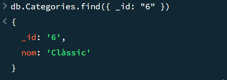

# Esquema de la Base de Dades

Aquesta base de dades està dissenyada per a una aplicació de recomanacions personalitzades de llibres. La base de dades utilitza MongoDB (NoSQL), on es guarden registres sobre llibres, usuaris i categories de llibres.

## Estructura de la Base de Dades

### **Col·lecció: Llibres**

La col·lecció **Llibres** conté tota la informació sobre els llibres disponibles a l'aplicació. Cada llibre té un títol, un autor, un any de publicació, una descripció breu i un conjunt de categories que el classifiquen. A més, inclou el camp **dataAfegit** que permet ordenar els llibres per la data d'afegit.

#### Exemple d'un registre de llibre:

```json
{
  "id": "9876",
  "titol": "El nom de la rosa",
  "autor": "Umberto Eco",
  "anyPublicacio": 1980,
  "descripcio": "Un misteri ambientat en un monestir medieval.",
  "categories": ["Misteri"]
}

```
### **Col·lecció: Usuaris**

La col·lecció **Usuaris** emmagatzema la informació dels usuaris de l'aplicació. Cada usuari té un **nom**, **email**, **llibres llegits**.

#### Exemple d'un registre d'usuari:

```json
{
  "id": "1",
  "nom": "Ana",
  "email": "ana@gmail.com",
  "llibresLlegits": ["9876", "1234", "5678"]
}

```
### **Col·lecció: Categories**

La col·lecció **Categories** emmagatzema la informació sobre les diferents categories o gèneres dels llibres. Cada categoria té un **nom**.

#### Exemple d'un registre de categoria:
```json
{
  "id": "1",

  
  "nom": "Misteri"
}

```
### Esquema relacional

Aixi es veuria si fos un esquema relacional


# Creació de la Base de Dades


He creat la BBDD amb dues colecions: **Llibres i Categories**


## Despres de l'imortació dels dos fitxers, aquestes son les consultes desde MongoDB Shell (mongosh):

### 1- De la col·lecció Llibres:


### 2- De la col·lecció Categories:





## Desde compass:


